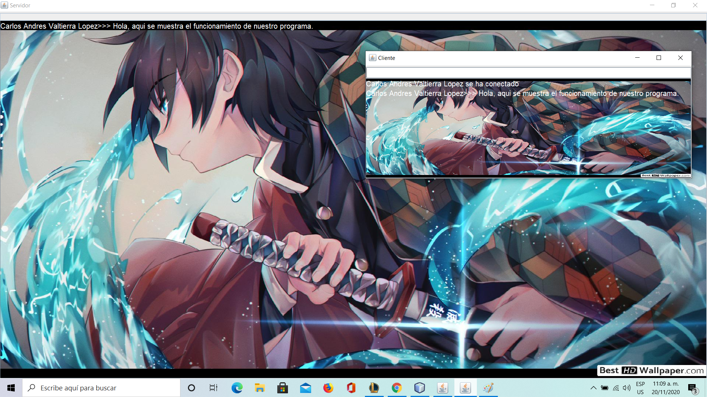

# Chat cliente-servidor.

Se desarrollo una aplicacion la cual realiza un chat entre cliente y servidor a traves de sockets e hilos.

# Link del funcionamiento del programa.

# Elementos visuales y funcionamiento.

-Se muestra dos ejecutables, el primero es el llamado "Principal Chat" el cual lanza nuestro servidor y a ese mismo se le asigna una direccion establecida por el usuario.

-A continuacion, se ejecuta el otro main, llamado "chatCliente" el cual lanza otra ventana pidiendonos el nombre del usuario y una direccion, la cual, debera ser la misma que usamos en nuestro servidor "127.0.0.1" por ejemplo...

*Una vez conectados nuestro servidor y cliente, a traves del cliente se pueden mandar mensajes y el servidor puede verlos reflejados al igual que contestar a esos mensajes.*

# Pre-requisitos 📋.

*Se necesita tener las librerias, el github y un IDE.*

*NetBeans 8.2 y GIT*

# Agradecimientos.

*Levy Rojas(nuestro docente) por alentarnos,y a mi por el esfuerzo.

# Referencias.

_https://classroom.google.com/u/0/c/MTIxOTQ5MjU4MDA0/a/MTIxOTc5MjUyMTE3/details_

_https://youtu.be/aUVfovz-vWk_

# Resultados.

